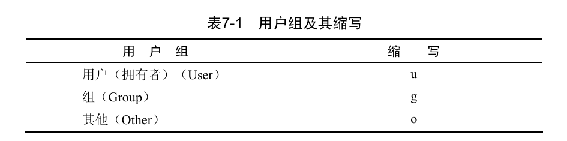

# 本次 linux 操作基于 centos
# 1. 基础命令
1. ls 基础命令
```bash
1. ls # 列出文件和文件夹
2. ls <file-path> # 列出其他文件夹的内容
3. ls <file-path>/*.png # 使用通配符 * 列出文件中的png
4. ls -R  # 查看子文件夹中的文件列表
5. ls -l # 单独一列显示内容，显示权限、所有者等详细信息
6. ls -m # 使用逗号相隔显示内容
7. ls -a # 显示隐藏的文件和文件夹
8. ls -F # 显示文件夹的类型 (* 可执行，/ 文件，没有附加就是普通文件)
9. ls -color # 用颜色区分显示
10. ls -r # 以相反的顺序显示列表内容
11. ls -x # 以文件的扩展名排序
12. ls -t # 按日期和时间排序
14. ls -S # 按文件大小排序
15. ls -h # 用K、M和G显示文件大小
```
2. pwd
```bash
1. pwd # 显示当前工作目录
```
3. cd 指令
```bash
1. cd # 切换到不同目录
2. cd ~ # 切换到 home 目录
3. cd - # 切换到以前目录
```
4. touch 更新/创建
```bash
1. touch <filename> # 如果 filename 存在才是将文件时间修改为当前时间，否则就是创建新文件只有获得修改文件的权限，才可以对文件使用touch命令，修改它的时间。否则，touch命令会运行失败
2. touch -t # 将文件的时间修改为任意时间
```
5. mkdir 创建新目录
```bash
1. mkdir <file> # 创建新目录
2. mkdir -p <file>/<file> # 想要一次创建多重目录时使用
3. midir -v # 显示创建过程
```
6. cp 复制操作
```bash
1. cp <old-path>/<file-name> <new-path> # 复制文件
2. cp <old-path>/*.txt <new-path> # 使用通配符复制
3. cp -i # 防止复制时覆盖重要的文件
4. cp -R <old-path> <new-path> # 复制文件夹
5. cp -v # 显示复制过程
6. cp -a # 复制文件到其他目录以作为完整的备份
```
7.  mv 移动操作
```bash
1. mv <old-path>/<file-name> <new-path> # 移动文件到新路径
2. mv <old-name> <new-name> # 重命名
```
8. rm 删除文件
```bash
1. rm <filename> # 删除文件
2. rm *.txt # 使用通配符删除
3. rm -v <filename> # 显示删除过程，不单独使用
4. rm -i <filename> # 防止删除重要文件，每次删除都要询问
5. rmdir <filename>  # 删除空目录
6. rm -rf <filename> # 删除文件和非空的目录 rm–Rf命令有可能损坏你的重要文件和系统。作为普通用户，一定要慎用rm –Rf命令。作为root用户使用rm–Rf命令时一定要保持高度警惕。
7. rm -- -cousin_roy.jpg # 特殊删除 如果涉及到 '-' 需要在前面加上 '--' 才能删除
```
9. su 变更用户
```bash
1. su # 无参数的时候就是切换到 root 用户
2. su <username> # 变更到其他用户
3. su -l # 变更到其他用户，包括其环境变量
4. su - # 变更成root用户，包括其环境变量
```
# 2. 学习指令
1. man 查看命令的用法
```bash
1. man ls # 查看 ls 的使用方法
# man命令提供的资料非常详细，。当然，并不是所有命令都提供了这么多信息
# NAME（命令名称）——命令的名称和简要的介绍。
#     * SYNOPSIS——命令的基本格式。
#     * DESCRIPTION——描述命令功能的概要介绍。
#     * OPTIONS（选项）——man命令最基本的部分：命令的各种选项，以及对每个选项的简短介绍。
#     * FILES（文件）——命令使用的其他文件。
#     * AUTHOR（作者）——编写命令的作者，以及联系信息。
#     * BUGS（错误）——已知的错误，以及如何报告新错误。
#     * COPYRIGHT（版权声明）——它的意义很明显，即版权信息。
#     * SEE ALSO（参见）——其他相关的命令。
2. man -a # 基于命令的功能来搜索指令，如  man -k list
3. man -f ls # 根据命令的名称快速查找命令的功能
```
2. 组合命令
```bash
1. ; # 使用 ; 分隔多个命令一次执行    ls -a;mkdir -vp test/x.txt;ls test/
2. && # 只有前面的命令执行成功才执行接下来的命令 ls -a&&mkdir -vp test/x.txt&&ls test/
3. || # 只有前面的命令运行失败才运行后面的命令
4. $() # 将一个命令的输出插入到另一个命令 echo "res:$(ls)"
5. | # 将一个命令的输出用作另一个命令的输入 如 ls -l | tee b.txt
6. > # 将命令的输出重定向到文件 如ls -1F / > c.txt
7. >| # 防止重定向时覆盖文件 ls -lF / >|  c.txt
8. >> # 将结果追加到  ls -Ft />> d.txt;echo $(cat d.txt)
9. < # 将文件命令作为输入 echo $(<d.txt)
```
# 3. 查看文件
1. cat 在标准输出设备上查看文件
```bash
1. cat a.txt # 查看文件内容
2. cat <filename1> <filename2> # 将文件拼接至标准输出设备
3. cat <filename1> <filename2> > <filename3>  # 将文件拼接至标准输出设备并且重定向到新文件
4. cat -n <filename1> <filename2> # 拼接文件，并给文件加上行号
```
2. 指令
```bash
1. less <filename> # 分屏查看文本文件
2. less -N <filename> # 分屏查看文本文件并且显示行号
3. /'<content>' # 在分页器中搜索，只能在状态实在查看内容的时候进行搜索
4. 在查看的时候长按 v 进入编辑模式
5. head <filename> # 查看前十行
6. head <filename1> <filename2> ... # 查看多个文件的前十行
7. head -n <count> <filename> # 查看文件的前 count 行
8. head -c # 查看文件前几个字节、几K字节或几M字节的内容,例如head -c 11k a.txt
9. tail <filename> # 查看最后10行内容
10. tail <filename1> <filename2> ... # 查看多个文件的最后10行内容
11. tail -n # 查看一个或多个文件的后面 n 行内容
12. tail -f # 查看一个或多个文件中不断更新的最后几行
```

# 4. chgrp 拥有者和权限
1. 修改文件或目录属于的用户组
```bash
1. chgrp achao a.txt # 将用户组更改为 achao
2. chgrp -R achao a.txt # 针对一个文件夹递归修改
3. chgrp -v <user-group> <filename> # 使用chgrp 命令查看文件用户组的变化
```

2. chown 修改文件和目录的拥有者
```bash
1. chown <user> <filename> # 修改文件或目录的拥有者
2. chown <user>:<user-group> <filename> # 同时修改文件和目录的拥有者和用户组 chown root:achao bin-n.txt
3. chown -v <user> <filename> # 查看修改过程 
# 因为chown能够完成chgrp的所有功能，所以几乎不需要使用 chgrp 命令，除非你喜欢。

```
3. chomd 权限基础



```bash
1. chmod [ugo][+-=][rwx] # 用字母表示法修改文件和目录的权限
2. chmod [0-7][0-7][0-7] # 用数字权限修改文件和目录的权限 
3. chmod -R # 递归地修改权限
4. chmod u[+-]s # 设置和清除suid 
5. chmod g[+-]s # 设置和清除sgid 
6. chmod [+-]t  # 设置和清除sticky bit 
```


# 5. 归档和压缩
1. zip 归档和压缩文件 

```bash
1. zip <filenaem>.zip <filename>.* # 压缩
2. zip -[0-9]  # 用zip 获得最好的压缩效果
3.  zip -[eP] 12345678 moby.zip *.txt  # 用密码保护压缩的Zip文档 ,使用 -P 选项对生成的Zip文档增加密码保护。但是不应该使用这个选项，因为它一点儿也不安全,应为使用 history 可以在历史中看到 -e 是对密码加密的
4. unzip <filename>.zip # 解压文件
5. unzip -v <filename>.zip # 查看解压文件的内容 
6. unzip -l <filename>.zip # 查看解压文件的内容
7. unzip -t <filename>.zip # 测试解压 
```


# 50 常用高级指令
```bash
find <file-dir> -name <filename> 按名称搜索文件
finr <file-dir> -type f mtime 7    查看近七天修改的文件

grep <content> file.txt                 # 搜索指定文本
grep -r <content> /path/to/dir          # 递归搜索目录中的文本
grep -i <content> file.txt              # 忽略大小写搜索


awk '{print $1}' /docker/docker.txt
awk '<command>' /docker/docker.txt
awk -F":" '{print $1, $3}' /etc/passwd       # 使用":"作为字段分隔符


sed 's/old_text/new_text/' file.txt          # 替换文本中的"old_text"为"new_text"
sed -i 's/old_text/new_text/' file.txt       # 直接修改文件
sed 's/这是/那是/' /docker/docker.txt         # 只是输出的时候短暂修改
sed -i 's/这是/就是/' /docker/docker.txt      # 直接修改，永久修改


tar -cvf <filename>.tar <file-path>       # 打包目录
tar -xvf <filename>.tar     #解包 tar

tar -czvf <filename>.gz <file-path>
tar -xzvf <filename>.gz # 解包 gz


bzip2 file.txt                              # 压缩文件
bunzip2 file.txt.bz2                        # 解压文件

zip archive.zip file1 file2                  # 压缩文件
unzip archive.zip                            # 解压 zip 文件


ssh user@remote_host                        # 连接到远程主机
ssh -i /path/to/key user@remote_host        # 使用私钥文件连接


scp file.txt user@remote_host:/path/to/dir   # 从本地复制文件到远程主机
scp user@remote_host:/path/to/file.txt .     # 从远程主机复制文件到本地

rsync -av /path/to/source/ /path/to/dest/    # 同步本地目录
rsync -avz user@remote_host:/path/to/dir /path/to/local/dir  # 同步远程目录


curl http://example.com                    # 获取网页内容
curl -O http://example.com/file.txt         # 下载文件
curl -X POST -d "param1=value1" http://example.com/api  # 发送 POST 请求


wget http://example.com/file.txt            # 下载文件
wget -r http://example.com/                  # 递归下载网站


netstat -tuln                               # 显示监听的端口
netstat -anp                               # 显示网络连接和相关程序

top                                        # 显示系统进程
htop                                       # 交互式进程查看器


ps aux                                     # 显示所有进程的详细信息
ps -ef                                      # 显示所有进程的标准格式


kill PID                                   # 终止指定 PID 的进程
kill -9 PID                                # 强制终止进程
pkill process_name                        # 终止所有匹配进程名称的进程

systemctl start service_name              # 启动服务
systemctl stop service_name               # 停止服务
systemctl restart service_name            # 重启服务
systemctl status service_name             # 查看服务状态
journalctl -xe                            # 查看最近的日志
journalctl -u service_name                # 查看指定服务的日志


```